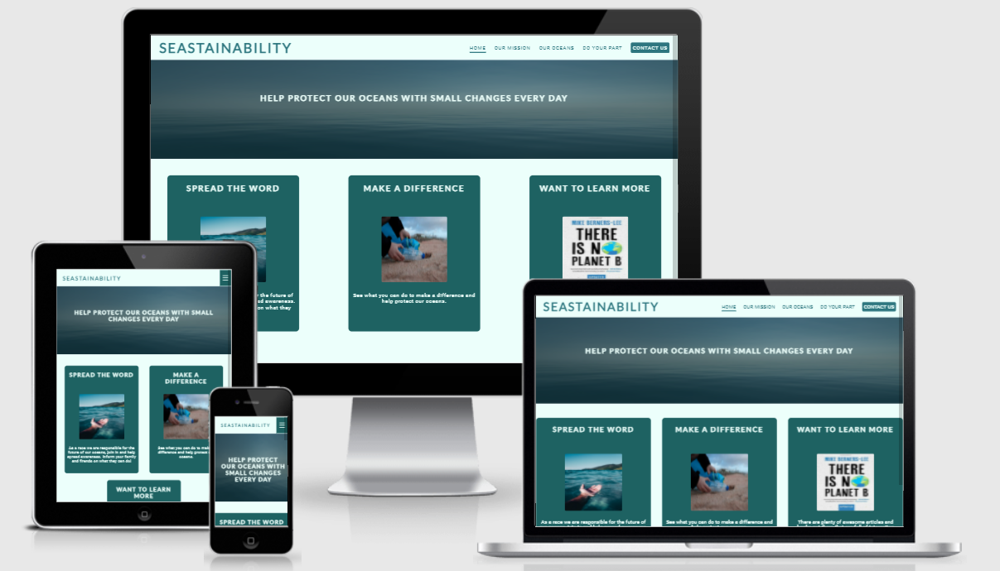
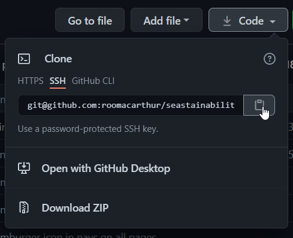

# Seastainability | Ruairidh MacArthur

## Code Institute - Milestone Project 1

### HTML/CSS Essentials - User Sentric, Static Front-End Website

[Click Here to view the Live Project.](https://roomacarthur.github.io/seastainability/)

[Click here to view the Repository.](https://github.com/roomacarthur/seastainability)

## Table of Contents

- [The Why](https://github.com/roomacarthur/seastainability#the-why)
- [(UX) User Experiance](https://github.com/roomacarthur/seastainability#ux-user-experiance)

- [Design](https://github.com/roomacarthur/seastainability#design)

  - [Design Brief](https://github.com/roomacarthur/seastainability#design-brief)
  - [Typography](https://github.com/roomacarthur/seastainability#typography)
  - [Colours](https://github.com/roomacarthur/seastainability#colours)
  - [Images](https://github.com/roomacarthur/seastainability#images)
  - [Wireframes](https://github.com/roomacarthur/seastainability#wireframes)
    - [Desktop](https://github.com/roomacarthur/seastainability#desktop)
    - [Tablet](https://github.com/roomacarthur/seastainability#tablet)
    - [Mobile](https://github.com/roomacarthur/seastainability#mobile)

- [Technologies](https://github.com/roomacarthur/seastainability#technologies)
- [Testing](https://github.com/roomacarthur/seastainability#testing)
- [Deployment](https://github.com/roomacarthur/seastainability#deployment)
- [Credits](https://github.com/roomacarthur/seastainability#credits)

## The Why

Bring interest into the habbits of being more sustainable to protect our oceans, Provide people with quick and easy facts and information to strengthen their opinions and every day actions.

## (UX) User Experiance

- ### The User

  - #### First Time User:
    - To be captivated with the content.
    - ~~To sign up for the monthly news letter.~~
    - To have a better understanding on how to protect our oceans.
    - To be able to navigate the site with ease.
  - #### Returning User:
    - To instantly know/remember how to navigate.
    - Find the information they require within as few actions as possible.
  - #### Issues for Users to overcome:
    - Fact checked information to provide trustworthy content.
    - Ease of navigation.
    - Fast loading pages to make the site available to everyone.
    - Responsive design so the site can be viewd on all devices.

### Future ideas:

- Impliment a newsletter signup widget that is stuck to the bottom of all pages.
- sticky header so the navbar is accessable from all points of the page.
- Add a Blog/RSS feed to keep people uptodate on relative articles and news.

## Design

### Design Brief:

For SEASTAINABILITY the whole idea is to provide simple and easy to read information on how to become more sustainable to help protect and save our oceans. The overall design principle for the site is to be simple and follow a stlye that has an essence of sustainablity about it, using relative colours and typography. The sites demographic is so vast that the site has to appeal to everyone that views it from young to old and all beliefs. The site will remain neutral but have a simplistic modern feel to it.

### Typography:

Following along with the design brief I want the user to have a very friendly and eco sensible experiance for this I have picked Two fonts Both from the Google Fonts library. Fonts used are [Lato](https://fonts.google.com/specimen/Lato?query=lato) for headings and [Roboto](https://fonts.google.com/specimen/Roboto?query=roboto) for all written content.

### Colours:

To keep the colours inline with the design brief and with the help of [Colorinspo](https://colorsinspo.com/color-palettes/search/?sterm=%232d767f) I have decided to go with the netural colours listed below.

- #1e6262 - Darkblue
- #2d767f - primary
- #b4f1f1 - skyblue
- #ecfffb - light

### Images:

All Images used within this site have beenn provided with [Pexels](https://pexels.com) a royalty free website.
all images have been compressed with the use of [Squoosh](https://squoosh.app) - images with an opaque overlay have been compressed heavier as the quality of the image isn't as important.
The Favicon used for the site was taken from [Favicon.cc](https://www.favicon.cc/?action=icon&file_id=690331)

### Content:

- Page content is static and won't change, when desiging the layout of pages this was taken into consideration. Page content can be found [HERE](https://docs.google.com/document/d/18xpv4xm6ch3qhcZeHQ55RjGOaYjjJ777VEZF4EyxMzs/edit?usp=sharing)

### Wireframes:

The basic structure of SEASTAINABILITY was sketched out on paper and then with the use of the software [BALSAMIQ](https://balsamiq.com/). I was able to take the sketches and turn them into a more professional and realistic looking guide.

#### Desktop:

- [Home](https://github.com/roomacarthur/seastainability/blob/main/assets/wireframes/desktop-home.png)
- [Our Mission](https://github.com/roomacarthur/seastainability/blob/main/assets/wireframes/desktop-ourmission.png)
- [Our Oceans](https://github.com/roomacarthur/seastainability/blob/main/assets/wireframes/desktop-ouroceans-1.png) _New_
  - [~~Our Oceans~~](https://github.com/roomacarthur/seastainability/blob/main/assets/wireframes/desktop-ouroceans.png) _Has been updated._
- [Do Your Part](https://github.com/roomacarthur/seastainability/blob/main/assets/wireframes/desktop-doyourpart-1.png) _New_
  - [~~Do Your Part~~](https://github.com/roomacarthur/seastainability/blob/main/assets/wireframes/desktop-doyourpart.png) _Has been updated._
- [Contact Us](https://github.com/roomacarthur/seastainability/blob/main/assets/wireframes/desktop-contactus.png)

#### Tablet:

- [Home](https://github.com/roomacarthur/seastainability/blob/main/assets/wireframes/tablet-home.png)
- [Our Mission](https://github.com/roomacarthur/seastainability/blob/main/assets/wireframes/tablet-ourmission.png)
- [Our Oceans](https://github.com/roomacarthur/seastainability/blob/main/assets/wireframes/tablet-ouroceans.png)
- [Do Your Part](https://github.com/roomacarthur/seastainability/blob/main/assets/wireframes/tablet-doyourpart.png)
- [Contact Us](https://github.com/roomacarthur/seastainability/blob/main/assets/wireframes/tablet-contactus.png)

#### Mobile:

- [Home](https://github.com/roomacarthur/seastainability/blob/main/assets/wireframes/mobile-home.png)
- [Our Mission](https://github.com/roomacarthur/seastainability/blob/main/assets/wireframes/mobile-ourmission.png)
- [Our Oceans](https://github.com/roomacarthur/seastainability/blob/main/assets/wireframes/mobile-ouroceans.png)
- [Do Your Part](https://github.com/roomacarthur/seastainability/blob/main/assets/wireframes/mobile-doyourpart.png)
- [Contact Us](https://github.com/roomacarthur/seastainability/blob/main/assets/wireframes/mobile-contactus.png)

## Technologies

### Languages used:

- [HTML](https://en.wikipedia.org/wiki/HTML5)
- [CSS](https://en.wikipedia.org/wiki/CSS)
- [MARKDOWN](https://en.wikipedia.org/wiki/Markdown)

## Testing:

For testing I will use multiple resources:

1. [Chrome Dev Tools - Lighthouse](https://developers.google.com/web/tools/lighthouse/)
2. [W3 Markup Validation Service](https://validator.w3.org/)
3. [W3 CSS Validation Service](https://jigsaw.w3.org/css-validator/)
4. [Seastainability testing sheet](https://docs.google.com/spreadsheets/d/1j5fTc2kvFslpWCKUyjA68CdsLZiLo4CTNZQrS0LRafA/edit?usp=sharing)

Using the above resources I will test all individual pages and note all bugts found in [Bugs & Fixes](https://github.com/roomacarthur/seastainability#bugs--fixes).
I will also use peer code review within the slack community and my collegues for a "fresh set of eyes" to help pick out any issues I may miss.

With the vigerous testing and fresh eyes I hope to cover all issues that may arrise and implement fast fixes.

### Testing Results:

indepth testing has been carried out, all results are shown [HERE](https://docs.google.com/spreadsheets/d/1j5fTc2kvFslpWCKUyjA68CdsLZiLo4CTNZQrS0LRafA/edit?usp=sharing) in my test results sheet.

### Lighthouse Results:

- index.html
  - [Desktop](https://github.com/roomacarthur/seastainability/blob/main/assets/lighthouse-testing/index-desktop-test.png)
  - [Mobile](https://github.com/roomacarthur/seastainability/blob/main/assets/lighthouse-testing/index-mobile-test.png)
- ourmission.html
  - [Desktop](https://github.com/roomacarthur/seastainability/blob/main/assets/lighthouse-testing/ourmission-desktop-test.png)
  - [Mobile](https://github.com/roomacarthur/seastainability/blob/main/assets/lighthouse-testing/ourmission-mobile-test.png)
- ouroceans.html
  - [Desktop](https://github.com/roomacarthur/seastainability/blob/main/assets/lighthouse-testing/ouroceans-desktop-test.png)
  - [Mobile](https://github.com/roomacarthur/seastainability/blob/main/assets/lighthouse-testing/ouroceans-mobile-test.png)
- doyourpart.html
  - [Desktop](https://github.com/roomacarthur/seastainability/blob/main/assets/lighthouse-testing/doyourpart-desktop-test.png)
  - [Mobile](https://github.com/roomacarthur/seastainability/blob/main/assets/lighthouse-testing/doyourpart-mobile-test.png)
- contactus.html
  - [Desktop](https://github.com/roomacarthur/seastainability/blob/main/assets/lighthouse-testing/contactus-desktop-test.png)
  - [Mobile](https://github.com/roomacarthur/seastainability/blob/main/assets/lighthouse-testing/contactus-mobile-test.png)

### Bugs & Fixes:

- ~~On mobile View the Border top for nav items doesn't fit 100% of screen width.~~ _fixed_
  - _Adjusted width of the li witin the mobile menu to 100vw, this moved the border-top to fill 100% of the screen._
- ~~Screen sizes smaller than 250px ourmission.html images are off center.~~ _fixed_
  - _Adjusted div width, to allow for snugger fit on page centering up all content._
- upon validating ourmission.html the following errors where found.
  - [Error 1](https://github.com/roomacarthur/seastainability/blob/main/assets/testing-images/ourmission-error1.png) _fixed_
  - [Error 2](https://github.com/roomacarthur/seastainability/blob/main/assets/testing-images/ourmission-error2.png) _fixed_
- ~~index.html content is squeezed when viewing on small laptop(1280 x 720).~~ _fixed_ [Evidence](https://github.com/roomacarthur/seastainability/blob/main/assets/testing-images/smalllaptopscreen-homepage-error.png)
  - _fixed by adding aditional columns to CSS grid as a buffer._
- In mobile view on Apple Devices the contact form submit and clear buttons load in an ios default style.
  - _fixed with -webkit- call in CSS._
- In mobile view ourmission.html images within .content div's will not center without !important tag.
  - _Direct decendant targeting, still has issues without !important tag._

## Deployment

### Deployment to GitHub Pages

1. Visit [Github](www.github.com).
2. Navigate to the [roomacarthur/seastainability](https://github.com/roomacarthur/seastainability) Repository.
3. Click settings along the top options bar.
4. Click pages found at the bottom of the lefthand navigation bar.
5. In the 'Source' section, click the dropdown menu that is labled 'none' and select "Main".
6. Click Save.
7. Page will auto refresh and provide you with a link to the Live GitHub Page for this repository.

The Page can sometimes take a little time to load and go live and this is expected.

### Cloning Seastainability Repository

1. Open GitBash and create a directory where you want to save the code.
   > mkdir "directoryname"
2. Navigate into the new directory.
   > cd "directoryname"
3. Navigate to the repository [roomacarthur/seastainability](https://github.com/roomacarthur/seastainability).
4. Click on "Code" and then copy the SSH address.

5. Navigate back to GitBash and clone the repository.
   > git clone git@github.com:roomacarthur/seastainability.git

The code will now be available within the cirectory you created. You can open the code up with the command

> code .

### Forking Seastainability Repository

If you wish to experiment with the code freely, you can achieve this by forking the repository. Forking a repository allows you to experiment without the original project being effected. To achieve this you need to:

1. Navigate to the repository [roomacarthur/seastainability](https://github.com/roomacarthur/seastainability).
2. In the top right of the page, below your profile you should see a "Fork" button. Simply click on this.
3. A copy of the repository will then be added to your own Repositories Page.

## Credits

1. [National Geographic](https://www.nationalgeographic.com/environment/article/10-things-you-can-do-to-save-the-ocean) - Content for doyourpart.html
2. [Teach Stacker](https://techstacker.com/how-to-responsive-youtube-videos/) - Making the Embeded youtube Videos responsive for smaller screen sizes
